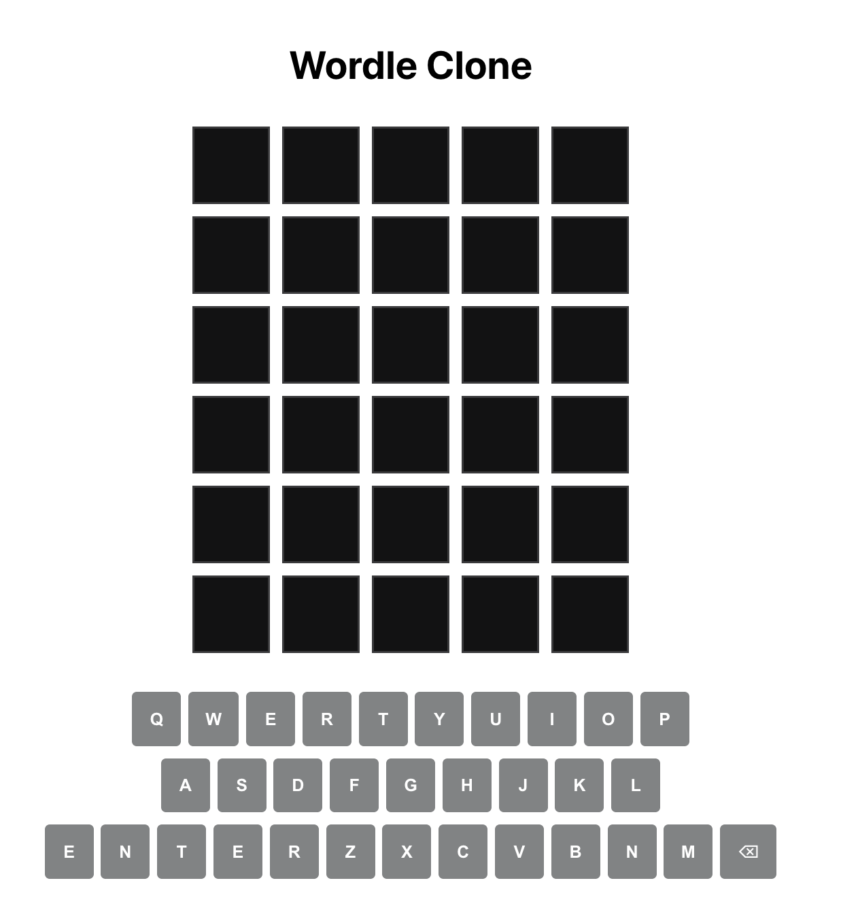
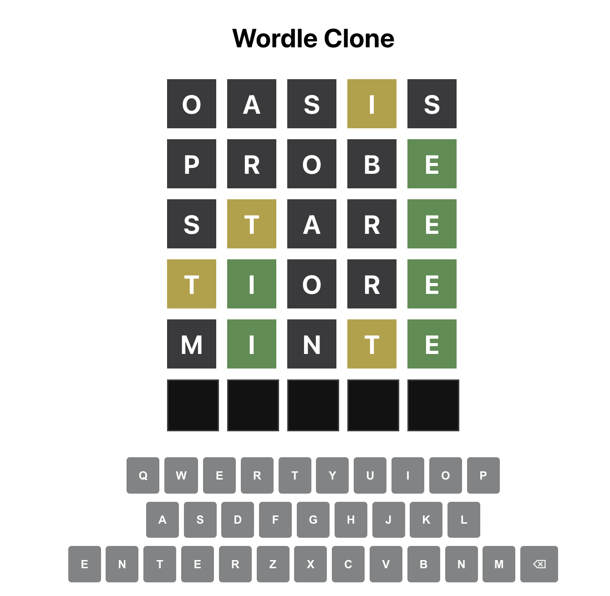

# 🟩 Wordle Clone — Fullstack Web App 🎉

This is a fullstack clone of the classic Wordle game, built with **React** on the frontend and **Express (Node.js)** on the backend. It replicates the core gameplay mechanics including color-coded feedback, virtual keyboard input, and random word generation.

---

## 📸 Preview

### 🕹️ Start Screen


### 🎯 Gameplay Example



---

## 🌐 Live Demo

- **Frontend (Vercel)**: [https://your-vercel-site.vercel.app](https://your-vercel-site.vercel.app)
- **Backend (Render)**: [https://wordle-project-backend.onrender.com](https://wordle-project-backend.onrender.com)

---

## ✨ Features

### 🎮 Game Mechanics
- Guess a 5-letter word within 6 tries
- Color feedback system:
  - 🟩 **Green**: Correct letter in correct position
  - 🟨 **Yellow**: Correct letter in wrong position
  - ⬛ **Gray**: Letter not in the word
- Virtual keyboard input
- Disables interaction during animation
- End-of-game popup with "Play Again" option

### 🔁 Word Logic
- Fetches a **random valid 5-letter word** from the backend on each game start
- Backend handles validation and feedback logic

### 🧠 UX & Design
- Game board with tile animations
- Color-coded keyboard feedback
- Responsive layout

---

## 🧱 Tech Stack

| Layer       | Technology         |
|-------------|--------------------|
| Frontend    | React + CSS        |
| Backend     | Express (Node.js)  |
| Hosting     | Vercel (frontend), Render (backend) |
| Deployment  | GitHub-integrated CI/CD |

---

## 🚀 Running Locally

### 1. Clone the project

```bash
git clone https://github.com/your-username/wordle-clone.git
cd wordle-clone
